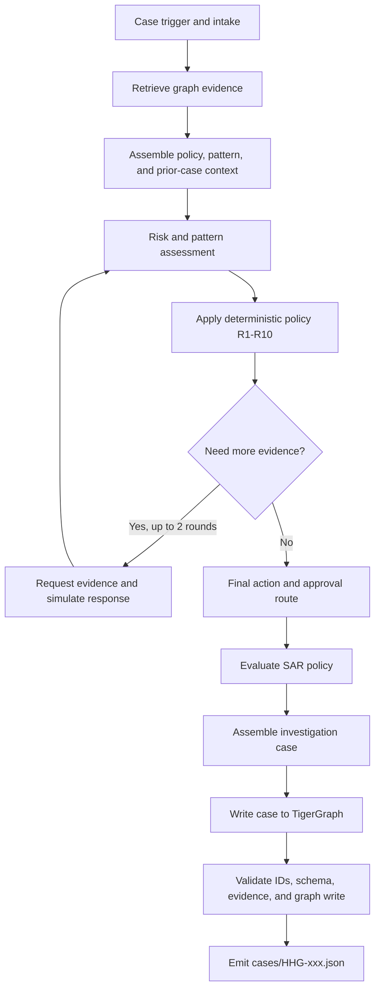

# HHGOA Fraud Investigation Agent 🚀

An investigation agent for the 20 HHGOA benchmark cases. It uses TigerGraph for transaction and case evidence, an LLM assessment step, and a deterministic policy engine to produce explainable case decisions, next actions, and (when required) SARs.

**Current verified state:** the HHGOA graph contains all 590,742 transactions; the six retrieval queries have been compared with the CSV backend; all 20 answer files have been generated and validated against the live graph; and the test suite reports 16 passing tests.

## Challenge and solution

The task is to investigate uncertain fraud signals across transaction history, identity and device signals, linked entities, and prior closed investigations. For each of 20 cases, the agent must document evidence and uncertainty, identify any relevant pattern, decide whether more evidence is needed, recommend a policy-compliant next action and approval route, and create a case record. A SAR is included only when the policy requires it.

The supplied dataset is based on IEEE-CIS. It intentionally has **no fraud outcome label**. Risk scores are signals, not fraud verdicts. Public IEEE-CIS/Kaggle labels must not be recovered or used to infer benchmark outcomes. The system instead grounds investigations in the provided records, prior closed cases, policy, and patterns, then applies the documented deterministic rules R1-R10.

The data inventory, column definitions, answer contract, policy rules, and benchmark details are documented in [`data/README.md`](data/README.md). The authoritative design and state machine are in [`Main_Plan.md`](Main_Plan.md).

## Graph schema


The live graph schema has eight vertex types: `Customer`, `Card`, `Transaction`, `DeviceProfile`, `EmailDomain`, `BillingRegion`, `ClosedCase`, and `InvestigationCase`, with 13 edge types connecting transactions, entities, closed investigations, and generated investigation cases. The GSQL definition is in [`schema/graph_schema.gsql`](schema/graph_schema.gsql).

## Architecture and orchestration

TigerGraph retrieval supplies structured evidence; it does not make the policy decision. The assessment provider contributes risk and pattern signals. The policy engine applies R1-R10 to choose actions and approval routes. The simulator supplies explicitly disclosed assumed customer responses when evidence requests are made.



The implemented flow is orchestrated in [`src/orchestrator.py`](src/orchestrator.py). It retrieves evidence through [`src/graph_client.py`](src/graph_client.py), assembles grounding context in [`src/graphrag.py`](src/graphrag.py), applies policy in [`src/policy_engine.py`](src/policy_engine.py), simulates evidence replies in [`src/simulate.py`](src/simulate.py), writes investigation memory to the `InvestigationCase` graph type, and validates the answer before emitting JSON.

The current context assembler uses local policy/pattern documents, graph evidence, similar closed cases, and graph-derived hints. It does not yet perform TigerGraph vector retrieval over a document collection.

## Run it

Use the project virtual environment from the repository root in PowerShell:

```powershell
.venv\Scripts\Activate.ps1
Copy-Item .env.example .env  # then set credentials; do not commit .env
```

The separate NVIDIA NIM to Cloudflare Workers AI runner is the current benchmark runner. It reads `NVIDIA_API_KEY`, `NVIDIA_MODEL` (optional), `CF_API_TOKEN`, `CF_ACCOUNT_ID`, and optionally `CLOUDFLARE_WORKERS_AI_MODEL` from `.env`.

```powershell
# One case
.venv\Scripts\python.exe scripts\run_cases_nvidia_cloudflare.py --case HHG-017

# All 20 cases
.venv\Scripts\python.exe scripts\run_cases_nvidia_cloudflare.py

# Validate answer files against the live TigerGraph graph
.venv\Scripts\python.exe scripts\validate_tigergraph_answers.py

# Run unit tests
.venv\Scripts\python.exe -m pytest
```

The TigerGraph-backed runner requires the configured MCP connection (`TG_HOST`, `TG_SECRET`, and `TG_GRAPHNAME`) and a running HHGOA graph. The CSV backend remains available for development and comparison via `GRAPH_BACKEND=csv`. The existing Gemini/Groq flow is separate; the NVIDIA/Cloudflare runner overrides the provider chain only for its own process.

Each generated `cases/HHG-xxx.json` contains the internal investigation, evidence and findings, decisions and actions, any policy-required SAR, and the required action/approval information before and after evidence requests. Simulated replies are marked as assumptions in the output.

## JEV status

**JEV was not used to generate the case responses or pass the benchmark validation.** The JEV client remains unwired: `src/config.py` raises `NotImplementedError`, and `src/jev_client.py` is a stub. The orchestrator catches that unavailable-client condition and uses the assessment fallback. The latest full case run used NVIDIA NIM as primary with Cloudflare Workers AI configured as fallback. Deterministic policy rules, rather than JEV or the LLM, select the allowed action and approval route.

## What remains

- Integrate JEV if it is still required by the intended architecture, then compare its assessment signals with the current provider path.
- Add TigerGraph vector search for policy, pattern, regulatory, and narrative knowledge if full document GraphRAG is required by the submission brief.
- Review the 20 investigations for semantic quality and calibration. Structural validation and graph-backed ID checks passed, but no hidden answer key is available here to certify outcome accuracy.
- Prepare the required end-to-end demo video, technical blog post, and social post. A dedicated analyst UI is also not implemented; add one if required for the demonstration.

The challenge task specification is preserved in [`TigerGraph Agentic Fraud Investigation HHGOA.md`](TigerGraph%20Agentic%20Fraud%20Investigation%20HHGOA.md).
