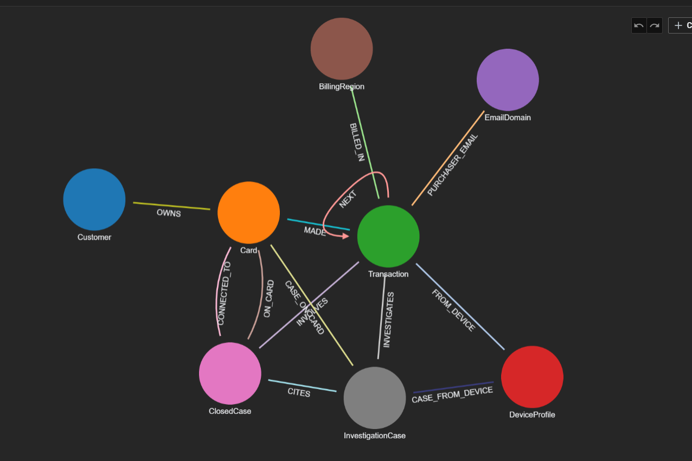
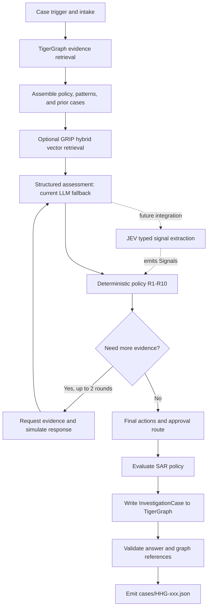

# HHGOA Fraud Investigation Agent

An investigation agent for the 20 HHGOA benchmark cases. It combines TigerGraph evidence retrieval, optional GRIP vector and hybrid retrieval, an LLM assessment step, and a deterministic policy engine that selects explainable actions, approval routes, and policy-required SARs.

## Challenge and solution

The task is to investigate fraud signals across transaction history, identity and device signals, linked entities, and prior closed investigations. For each case, the agent records evidence and uncertainty, identifies relevant patterns, requests more evidence when appropriate, selects a policy-compliant action and approval route, and writes an investigation case. A SAR is included only when the policy requires one.

The supplied IEEE-CIS-derived data intentionally omits the fraud outcome label. Risk scores are signals, not verdicts. **Do not recover or use public IEEE-CIS/Kaggle labels to infer HHGOA outcomes.** Decisions are grounded in the supplied records, prior closed cases, policy, and documented patterns, then constrained by deterministic rules R1–R10.

Dataset schema, answer format, rules, and benchmark requirements are in [`data/README.md`](data/README.md). The authoritative architecture and state machine are in [`Main_Plan.md`](Main_Plan.md).

## Graph schema



The original HHGOA topology has eight vertex types and 13 edge types. The optional GRIP corpus added four vertex types (`Paper`, `Author`, `Concept`, `PaperEmb`) and two edge types (`AUTHORED_BY`, `MENTIONS`), making the current graph schema 12 vertex types and 15 edge types. The live graph contains 590,742 `Transaction` vertices. The base GSQL schema is [`schema/graph_schema.gsql`](schema/graph_schema.gsql); the additive GRIP schema is in [`schema/grip_corpus_schema.gsql`](schema/grip_corpus_schema.gsql).

## Architecture and orchestration

TigerGraph supplies structured evidence; the LLM assessment contributes risk and pattern signals; the deterministic policy engine applies R1–R10 and selects actions and approval routes. When more evidence is needed, the simulator supplies clearly disclosed assumed customer responses for up to two rounds.



The flow is implemented in [`src/orchestrator.py`](src/orchestrator.py). [`src/graph_client.py`](src/graph_client.py) retrieves evidence, [`src/graphrag.py`](src/graphrag.py) assembles policy and case context, [`src/policy_engine.py`](src/policy_engine.py) makes the deterministic policy decision, [`src/simulate.py`](src/simulate.py) models disclosed evidence responses, and [`src/validate.py`](src/validate.py) checks answer consistency. The GRIP path is selected with `GRAPHRAG_MODE=grip`; `static` remains the default and retains the non-vector context path.

**JEV is future scope, not part of the validated run.** The planned integration would use JEV's typed question catalog to extract structured signals from graph evidence and case context (for example, card testing, new device, shared device, out-of-region activity, and customer denial). It would provide those `Signals` to the existing deterministic policy engine, with the current LLM assessment retained as a fallback during rollout. JEV would not directly choose actions or bypass R1–R10. Before adoption, compare JEV and fallback signals case by case, record provider/latency/token metadata, and rerun validation. [`src/jev_client.py`](src/jev_client.py) is currently an unwired stub.

### How the MCP and vector path works

GRIP runs as a separate MCP server process configured for the existing `HHGOA` TigerGraph graph. The application starts a local stdio MCP client, which sends named tool calls and JSON arguments to that server; the server's TigerGraph adapter executes retrieval against the configured graph and returns structured results. The launcher checks that the backend is TigerGraph and the graph ID is `HHGOA`; case retrieval also rejects responses without a vector-search marker and results. If GRIP errors, the application logs the error and continues with static context, so the investigation remains runnable.

The GRIP MCP tools used were:

- `graphrag_status`, `graphrag_schema`, `graphrag_entity_types`, and `graphrag_relationship_types` to inspect the live backend and topology.
- `graphrag_ingest` to load policy text, fraud-pattern text, and closed-case narratives into the additive GRIP graph schema. Transaction rows were not embedded.
- `graphrag_hybrid_search` during GRIP context assembly, with vector weight 0.7, graph weight 0.3, depth 2, and top-k 6. The code checks `query.note == "vector"` and rejects empty results.
- `graphrag_batch_similarity` to cosine-rerank candidate closed cases.
- `graphrag_format` to format selected context with a 350-token formatter budget.

These tools improve evidence retrieval and context selection; they do not establish that a fraud verdict is correct. Accuracy and consistency are supported by grounding evidence in live graph records, preserving exact graph IDs, applying deterministic R1–R10 policy after assessment, constraining summaries to selected actions, and validating answer schemas, graph-known IDs, graph writes, and action/prose consistency. All 20 current static answer files passed live validation. All 20 GRIP-mode runs completed, but per-case vector success/fallback was not recorded; predictive accuracy against an answer key is therefore not established.

## Static versus GRIP vector comparison

The static path uses graph retrieval and local policy/pattern context without GRIP vector retrieval. The GRIP path adds vector and graph hybrid retrieval over policy, fraud-pattern, and closed-case text documents. No transaction rows were embedded. GRIP is optional; static remains the default because the comparison was mixed and individual GRIP retrieval responses were not saved per case. GRIP calls can fall back to static context, so the results below are an exploratory run comparison, not proof that every GRIP answer used vector results.

Table values show `status / verdict / pattern / fraud probability`. “Static reference” is the archived no-GRIP run; it is not a same-session control for every case, and provider/run differences affect comparisons. The historical GRIP artifacts predate the action-consistency fix; current `cases/` files have that fix.

| Case | Static reference (no vector) | GRIP vector run |
|---|---|---|
| HHG-001 | closed_legitimate / legitimate / none / 0.15 | escalated / uncertain / none / 0.28 |
| HHG-002 | open / uncertain / card_not_present_fraud / 0.62 | open / uncertain / card_not_present_fraud / 0.58 |
| HHG-003 | closed_legitimate / legitimate / none / 0.10 | escalated / uncertain / out_of_region_use / 0.28 |
| HHG-004 | open / uncertain / card_not_present_new_device / 0.68 | closed_fraud / fraud / card_not_present_new_device / 0.82 |
| HHG-005 | closed_fraud / fraud / card_not_present_new_device / 0.75 | closed_fraud / fraud / account_takeover / 0.86 |
| HHG-006 | escalated / fraud / card_not_present_new_device / 0.74 | escalated / fraud / account_takeover / 0.74 |
| HHG-007 | escalated / uncertain / none / 0.25 | escalated / uncertain / out_of_region_use / 0.28 |
| HHG-008 | escalated / uncertain / card_not_present_fraud / 0.50 | escalated / uncertain / card_not_present_fraud / 0.28 |
| HHG-009 | closed_legitimate / legitimate / none / 0.15 | open / uncertain / none / 0.28 |
| HHG-010 | escalated / uncertain / card_not_present_new_device / 0.60 | escalated / uncertain / card_not_present_new_device / 0.60 |
| HHG-011 | closed_fraud / fraud / card_testing / 0.90 | closed_fraud / fraud / card_testing / 0.94 |
| HHG-012 | closed_legitimate / legitimate / none / 0.10 | escalated / uncertain / none / 0.28 |
| HHG-013 | escalated / uncertain / account_takeover / 0.60 | escalated / fraud / account_takeover / 0.74 |
| HHG-014 | open / uncertain / account_takeover / 0.55 | closed_fraud / fraud / account_takeover / 0.74 |
| HHG-015 | escalated / fraud / card_not_present_new_device / 0.82 | closed_fraud / fraud / card_not_present_new_device / 0.86 |
| HHG-016 | open / uncertain / card_not_present_new_device / 0.68 | open / uncertain / card_not_present_new_device / 0.68 |
| HHG-017 | open / uncertain / none / 0.20 | open / uncertain / none / 0.28 |
| HHG-018 | escalated / uncertain / none / 0.30 | escalated / uncertain / none / 0.28 |
| HHG-019 | closed_fraud / fraud / card_not_present_new_device / 0.80 | closed_fraud / fraud / account_takeover / 0.86 |
| HHG-020 | escalated / fraud / account_takeover / 0.70 | escalated / fraud / account_takeover / 0.74 |

HHG-004 is a material same-session difference: GRIP changed the result from open/uncertain (0.68) to closed_fraud/fraud (0.82). HHG-019 changed the pattern while status, verdict, and actions agreed. Keep static as default until retrieval success is recorded per case and the differences are reviewed. Full evidence and action comparisons are in [`reports/grip_ablation/comparison_report.md`](reports/grip_ablation/comparison_report.md).

The current static submission results, including final actions and SAR decisions for all 20 cases, are in [`reports/grip_ablation/final_static_cases_report.md`](reports/grip_ablation/final_static_cases_report.md). After the action-consistency fix, all 20 passed live TigerGraph validation, and the current `cases/` directory has no action-like summary text paired with an empty final action list.

### Token use and completion

Vector retrieval is intended to save prompt tokens by selecting a small set of relevant policy, pattern, and closed-case documents instead of putting the whole text corpus into every assessment. The current GRIP context is capped (top six results and a bounded formatter budget), and the 590,742 structured transaction vertices are not embedded. This gives the system a bounded, query-focused context path.

The measured case runs do **not** show a consistent token reduction, so this should be described as a design benefit rather than a proven across-the-board saving. Same-session examples were mixed: HHG-003 used 19,903 tokens in the static control and 13,656 with GRIP (about 31% fewer); HHG-012 used 17,499 and 13,018 (about 26% fewer); HHG-017 used 8,367 and 12,950 (about 55% more). Provider and run differences were not fully controlled, and exact provider identity is not saved per answer. See the per-case figures in [`reports/grip_ablation/comparison_report.md`](reports/grip_ablation/comparison_report.md). The GRIP run completed all 20 cases, but because the app can fall back to static context and per-case retrieval outcomes were not persisted, this proves the run completed—not that all 20 used vector results successfully.

## LLM and agent status

The LLM assesses risk and patterns; it does not select policy actions. R1–R10 in the policy engine control permitted actions and approval routes.

- The current static submission runner is [`scripts/run_cases_groq.py`](scripts/run_cases_groq.py): Groq first, with a configured free OpenRouter model as fallback. It does not enable Gemini.
- The separate experimental provider runner is [`scripts/run_cases_nvidia_cloudflare.py`](scripts/run_cases_nvidia_cloudflare.py): Groq → NVIDIA NIM → Cloudflare Workers AI. It does not change the static runner or the normal provider configuration.
- Per-call provider identity is not stored in each answer JSON. Some reruns also encountered provider rate limits and used deterministic graph-derived assessment fallback, so do not attribute every answer to a particular LLM without run logs.
- **JEV was not used to generate the answers or pass validation.** Its client remains unwired; the orchestrator uses the assessment fallback when JEV is unavailable. The detailed design and remaining JEV integration status are documented in [`src/jev_client.py`](src/jev_client.py) and [`reports/grip_ablation/HANDOFF.md`](reports/grip_ablation/HANDOFF.md).

## Setup and usage

Use the project virtual environment from the repository root in PowerShell. Copy `.env.example` to `.env`, then fill in credentials locally; do not commit `.env`.

```powershell
.venv\Scripts\Activate.ps1
Copy-Item .env.example .env
```

The TigerGraph path requires a running HHGOA graph and `TG_HOST`, `TG_SECRET`, and `TG_GRAPHNAME`. Use `GRAPH_BACKEND=csv` for local development without TigerGraph. Use `GRAPHRAG_MODE=static` for the default context path; set `GRAPHRAG_MODE=grip` to enable optional GRIP retrieval.

```powershell
# Run a single case or the complete static Groq/OpenRouter pack
.venv\Scripts\python.exe scripts\run_cases_groq.py --case HHG-017
.venv\Scripts\python.exe scripts\run_cases_groq.py

# Run the separate Groq/NVIDIA/Cloudflare provider experiment
.venv\Scripts\python.exe scripts\run_cases_nvidia_cloudflare.py --case HHG-017

# Run one case with static context or GRIP vector context; outputs go under reports/grip_ablation
.venv\Scripts\python.exe scripts\run_grip_case.py HHG-017 static
.venv\Scripts\python.exe scripts\run_grip_case.py HHG-017 grip

# Validate all current answers against the live graph and run unit tests
.venv\Scripts\python.exe scripts\validate_tigergraph_answers.py
.venv\Scripts\python.exe -m pytest
```

The GRIP corpus contains four policy chunks, one fraud-pattern chunk, and 5,565 closed-case text documents (5,570 total). It uses Cloudflare Workers AI embeddings with 768 dimensions. GRIP's current hybrid weighting is 0.7 vector / 0.3 graph; the adapter combines scaled scores and is not Reciprocal Rank Fusion. See the weight probe and ingestion notes in [`reports/grip_ablation/HANDOFF.md`](reports/grip_ablation/HANDOFF.md).

## Verified status and remaining work

- TigerGraph `HHGOA` has 590,742 transactions; the latest status probe identified the real TigerGraph backend and graph. The saved live probe is [`reports/grip_ablation/live_status_after_benchmark.json`](reports/grip_ablation/live_status_after_benchmark.json).
- The current static submission files passed live validation **20/20**; pytest passed **24 tests**.
- Static remains the production default. GRIP is functional on the configured graph, but per-case retrieval success/fallback metadata should be persisted before treating the A/B comparison as conclusive.
- Review material outcome and pattern differences, then complete the remaining semantic review, analyst UI/demo, and blog/post deliverables if required by the submission.

The original task specification is [`TigerGraph Agentic Fraud Investigation HHGOA.md`](TigerGraph%20Agentic%20Fraud%20Investigation%20HHGOA.md).

## Submission details

1. **Public repository:** [https://github.com/Tanmay-say/JEVeleric-HHGOA_TASK4](https://github.com/Tanmay-say/JEVeleric-HHGOA_TASK4)
2. **Answer files:** keep all 20 validated JSON answers at the repository root in `cases/`, one file per case, named exactly `HHG-001.json` through `HHG-020.json` as listed in `case_pack.csv`. The current workspace contains 20 such files.
3. **LLM model used:** the static runner uses Groq (`GROQ_MODEL` from local configuration) with OpenRouter free-model fallback (the runner pins `google/gemma-4-26b-a4b-it:free`). The answer files do not log the model used for each individual case; provider limits also caused some deterministic graph-derived fallbacks. Report the configured model chain, not a single verified model for every answer.
4. **Agent framework used:** custom Python orchestration in `src/orchestrator.py`, with TigerGraph retrieval and an optional GRIP MCP vector/hybrid layer. No LangChain or LlamaIndex framework is used. JEV integration is future scope and did not generate these answers.
5. **TigerGraph experience:** the graph-backed evidence queries, case writes, and live answer validation worked against the 590,742-transaction HHGOA graph. The main friction was operational latency: loading and live validation required polling/checking graph state, and pyTigerGraph emitted deprecated vertex-parameter warnings before retrying affected requests with GET. GRIP added useful policy/pattern/closed-case retrieval, but some case outcomes changed and per-case retrieval/fallback metadata was not persisted, making the A/B result harder to audit. Better loading-job status visibility, clear file-transport guidance, faster query diagnostics, and built-in per-request retrieval/provider traces would improve the experience.
